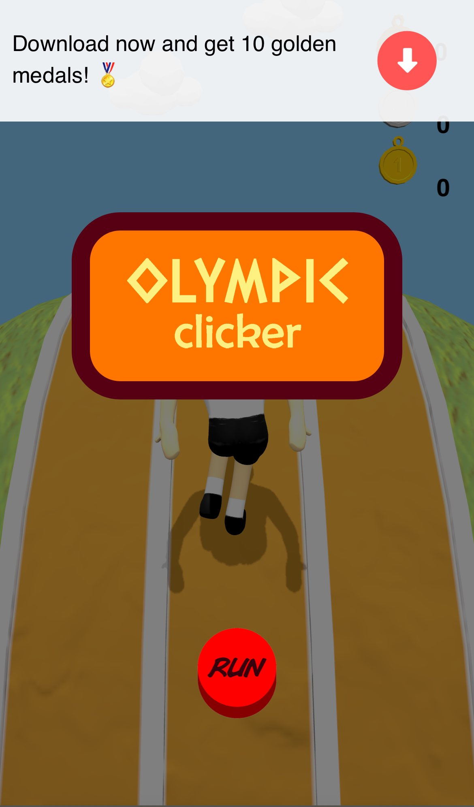
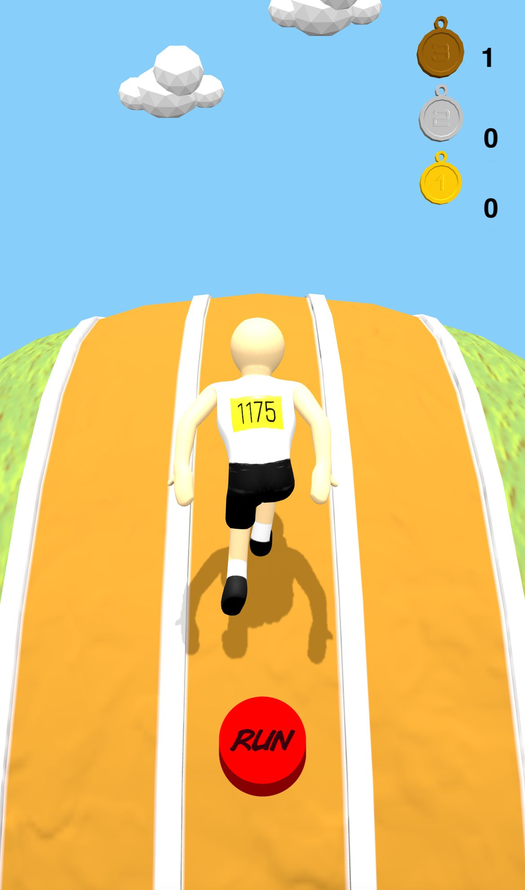

# Olympic Clicker

## Description
Olympic Clicker is a game developed for the EPITA x E-ARTSUP Game Jam. It is built using Three.js, a JavaScript library for creating 3D graphics in the browser.

## Features
- Click on the button to make your character run faster !
- Play the slot game between every stages to boost your stats

## Usage
- Click on the button to earn points
- Play the slot game to boost your stats
- Reach the end of the track to download the game

## Contributing
Contributions are welcome! If you have any ideas or improvements, feel free to submit a pull request.

## Credits
- Developed by [Raffi TUTUNJIAN](https://github.com/RaffiTutun01), [Joey LE](https://github.com/Dynistrios), [John KONDOZOPULOS](https://github.com/JohnKondo)
- Under the direction of [Augustin DELGORGUE](https://github.com/II-Vinos-II)
- Graphics by [Cory AMITRANO](https://www.artstation.com/cimetia)
- Built with [Three.js](https://threejs.org/)
- Game Jam hosted by EPITA and E-ARTSUP